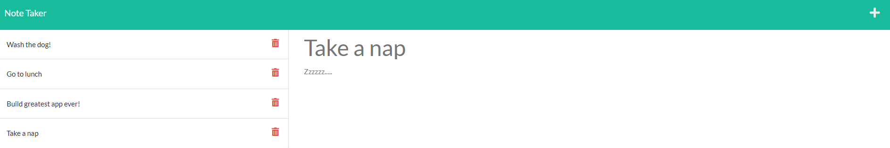
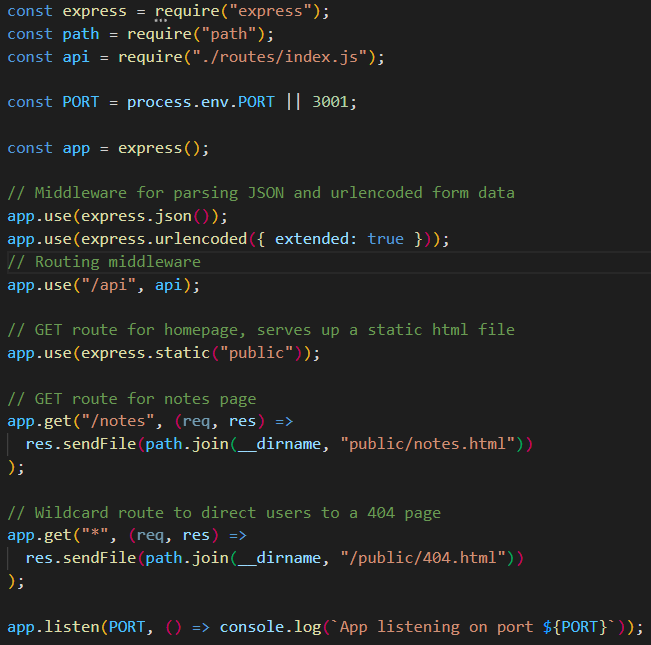

# note-taker

Note taker is a border line full stack web application allowing users to create notes with a title and body.  Data persistence is achieved by storing the new note data in a json file.

## Server

My backend server is built in Node.js, with the Express npm package. To run this locally, enter "npm i" from the command line to install Express, as well as the UUID npm, which is used to create unique id's for each note entered. Once the dependencies have been installed, from the Dev file, enter "node server.js" to start up the server.  If successful, "App listening on port 3001" will appear in the console.  In your browser, go to "localhost:3001".

## Backend API's

From the client side, users are able to view store notes, add new notes, as well as delete notes.  Each one of these http methods (GET/POST/DELETE), hits an endpoint on the bakend to perform the requested task.  The Express router was used to organize routes, and to keep the server.js file lean.

## Conclusions

With this project I was able to focus on successfully building a back end web server to handle requests submitted from a browser.  Routing for all http request are organized in a conventional mannor.  This live server can also be viewed on Heroku.

## Check it out

[GitHub repo](https://github.com/ObviousEcho/note-taker)  

[Heroku deployed site](https://blooming-ridge-50621.herokuapp.com/notes)